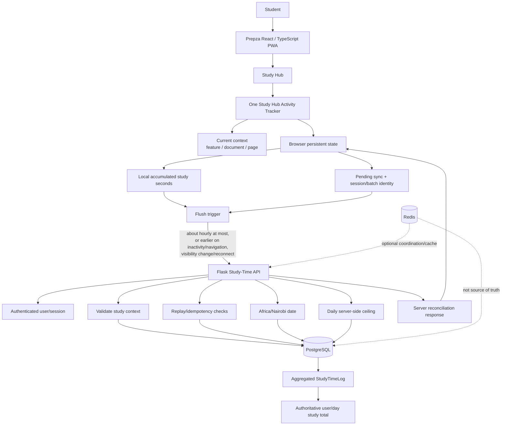

# Prepza Study Hub Study-Time Architecture

**Status:** Design baseline — proposed implementation to be verified by tests before freeze  
**Branch:** `main`  
**Scope:** Study Hub activity tracking, local accumulation, synchronization, PostgreSQL, Redis boundaries

## 1. Decision summary

The Study Hub is tracked as **one learning-activity system per student/session**, not as independent clocks owned by individual documents.

Documents, pages, and features remain **context** for the activity. They may be recorded for analytics and validation, but they must not create separate authoritative study-time budgets that can accidentally double-count the same student's activity.

The authoritative durable total remains PostgreSQL.

The browser is responsible for temporarily accumulating activity so normal Study Hub use does not require a database write every few seconds.

The server remains authoritative for authentication, study-context validation, Nairobi calendar boundaries, replay protection, and the daily anti-gaming ceiling.

Redis is **not** the durable source of truth for study time.

---

## 2. The mental model

A student can move through:

`Study Hub → Document A → Document B → Quiz → Document A`

without creating four independent clocks.

Conceptually:

`Study Hub total = one authoritative learning-time total`

while:

`document / page / feature = context about where that time was spent`

For example:

| Activity | Study Hub total | Context |
|---|---:|---|
| Reading Document A | 20 min | document A / reading |
| Reading Document B | 15 min | document B / reading |
| Quiz | 10 min | quiz |
| Reading Document A again | 5 min | document A / reading |
| **Total** | **50 min** | one Study Hub activity total |

The context can be retained for analytics, but the system must not maintain four independent authoritative timers.

---

## 3. Full architecture



### Architecture rule

The important line is:

**Browser accumulation → Flask validation → PostgreSQL authority**

not:

**Browser → Redis → PostgreSQL**

and not:

**Browser → one database timer per document.**

---

## 4. Frontend design

### 4.1 One global Study Hub tracker

The frontend should have one authoritative client-side activity-tracking layer for Study Hub.

It knows:

- whether Study Hub is visible;
- whether the student is actively interacting;
- when the Study Hub learning session started;
- accumulated seconds;
- current feature;
- current document/page context;
- pending unsynchronized time;
- synchronization state.

Individual Study Hub screens should **report context to the tracker**, not create their own independent study clocks.

### 4.2 Context changes

Moving from:

`Document A → Document B`

does not reset the Study Hub clock.

Instead:

`currentContext = Document B`

The accumulated Study Hub time continues.

This avoids duplicated timers and makes totals easier to reconcile.

### 4.3 Browser persistence

Local state must survive ordinary reloads and temporary network loss.

The state should contain enough information to safely resume:

- user identity;
- current/local calendar date;
- accumulated total;
- already-synchronized total;
- pending batches;
- synchronization/batch identifiers;
- optional feature/document context.

The existing repository already has an offline Study Activity accumulator using local storage and Nairobi date keys. The implementation work should **reconcile and simplify that existing mechanism**, not create a third timer.

---

## 5. When synchronization happens

The target is **not** to send a heartbeat every few seconds.

Preferred triggers:

1. normal accumulation locally;
2. periodic low-frequency flush, approximately once per hour at most;
3. earlier flush when the student leaves Study Hub;
4. earlier flush when the browser becomes hidden;
5. earlier flush during navigation where the lifecycle permits it;
6. flush after reconnecting from offline state;
7. flush before important lifecycle termination when the browser permits a reliable request.

The hourly period is a batching target, not permission to lose an hour of study time.

If the student becomes inactive or leaves Study Hub earlier, the pending time should be flushed earlier.

---

## 6. Active learning detection

Study Hub time must not mean "the browser tab was open for an hour."

The tracker should continue crediting time only while the student satisfies the activity rules.

The current repository already has a visibility/interactivity concept in the offline tracker. The redesigned global tracker should preserve that intent.

Examples of signals:

- document/tab visibility;
- recent interaction;
- explicit Study Hub presence;
- navigation into/out of Study Hub.

When the student becomes inactive:

`active study clock stops`

When the student interacts again:

`active study clock resumes`

---

## 7. Backend contract

The server must accept a **safe batch/reconciliation representation**, rather than requiring a fresh heartbeat every 20–30 seconds.

A sync request should conceptually contain:

```
user/session identity
study date
absolute or monotonic local total
sync/session/batch identity
optional activity/context metadata
```

The server then:

1. authenticates the student;
2. validates the request;
3. determines the authoritative Nairobi study date;
4. validates the submitted context where required;
5. checks replay/idempotency state;
6. compares the submitted total with the server baseline;
7. accepts only the legitimate new amount;
8. enforces the daily server ceiling;
9. updates the aggregate;
10. returns the authoritative server total.

The endpoint must be safe if the exact same request is sent twice.

---

## 8. Retry safety

A network failure can happen after PostgreSQL commits but before the browser receives the response.

Therefore:

```
Browser sends 47 min
        ↓
Server commits 47 min
        ↓
Network response is lost
        ↓
Browser retries
        ↓
Server recognizes same batch/absolute target
        ↓
No second 47-minute credit
```

This is mandatory.

Study-time synchronization must be **idempotent**.

---

## 9. PostgreSQL

PostgreSQL remains the durable source of truth.

The existing `StudyTimeLog` design aggregates by:

- user;
- calendar date;
- feature.

That aggregate shape is useful and should be retained unless implementation inspection proves a different schema is necessary.

The key design change is **how time reaches the aggregate**, not blindly creating one database row per heartbeat.

### Important clarification

Local batching primarily saves:

- HTTP requests;
- PostgreSQL transactions;
- connection activity;
- application CPU;
- network traffic.

It does **not** dramatically reduce disk space by itself because the current database already aggregates study time rather than storing one permanent row for every heartbeat.

---

## 10. Daily ceiling

The existing server-side ceiling is approximately 12 hours per Nairobi calendar day.

This is an **anti-gaming credit ceiling**, not a claim that Prepza prevents a student from studying for more than 12 hours.

The server must remain authoritative.

A malicious or corrupted browser must not be able to submit:

`50000 seconds`

and have the database blindly accept it.

---

## 11. Offline behaviour

A student may continue studying while temporarily offline.

The browser therefore keeps unsynchronized study time locally.

When connectivity returns:

```
local pending time
      ↓
server baseline
      ↓
absolute/monotonic reconciliation
      ↓
server accepts only legitimate difference
      ↓
local pending state marked synchronized
```

The browser must never blindly send:

`"add 3600 seconds"`

without replay protection.

The preferred model is an absolute/monotonic target plus an idempotent sync identity.

---

## 12. Feature and document analytics

Study Hub should have **one authoritative total**, but context can still be retained.

For example:

```
Study Hub total: 50 min

Context breakdown:
  Reading:      35 min
  Quiz:         10 min
  Mind map:      5 min

Document context:
  Economics 1:  25 min
  Economics 2:  10 min
  Other:        15 min
```

These breakdowns must reconcile with the authoritative Study Hub total.

They must not become independent entitlement counters unless a separate product requirement explicitly calls for that.

---

## 13. Product activity vs Study Hub study time

These are different concepts.

### Product activity

Broad application engagement such as:

- opening Prepza;
- navigation;
- messaging;
- general presence.

### Study Hub study time

Actual learning activity inside Study Hub.

### Feature context

Reading, quiz, flashcards, podcast, mind map, tutor, etc.

These should not be mixed into one giant heartbeat system.

The current repository contains two global activity-heartbeat paths in addition to the Study Hub offline accumulator. The implementation phase must consolidate this rather than adding another timer.

---

## 14. Redis

Redis is optional infrastructure for this design.

It may be used for:

- short-lived coordination;
- caching;
- shared application infrastructure;
- other existing realtime workloads.

It should **not** be the authoritative store for Study Hub study seconds.

If Redis disappears, PostgreSQL must still contain the durable study-time truth.

---

## 15. Failure scenarios

| Failure | Expected result |
|---|---|
| Browser reload | Local unsynced study state survives normally |
| Temporary network loss | Time accumulates locally |
| Response lost after DB commit | Retry does not double-count |
| Duplicate sync | Idempotency prevents duplicate credit |
| Tab hidden | Active study credit stops; pending time may flush |
| Student leaves Study Hub | Pending time may flush |
| Browser reconnects | Pending local time synchronizes |
| Malicious huge submission | Server ceiling and validation reject/cap it |
| Redis unavailable | Durable study total remains PostgreSQL-backed |
| Server restarts | PostgreSQL total survives |
| Nairobi midnight | Server assigns credit to authoritative Nairobi date |

---

## 16. Sequence diagram

```mermaid
sequenceDiagram
    participant S as Student
    participant UI as Study Hub UI
    participant L as Browser Local State
    participant API as Flask Study API
    participant DB as PostgreSQL
    participant R as Redis

    S->>UI: Open Study Hub
    UI->>L: Start/resume one Study Hub session

    S->>UI: Study / interact
    UI->>L: Accumulate active seconds
    UI->>L: Update current document/feature context

    S->>UI: Switch document/feature
    UI->>L: Change context only
    UI->>L: Continue same Study Hub clock

    Note over L: Accumulate locally
until flush condition

    L->>API: Idempotent study-time sync
    API->>API: Authenticate + validate
    API->>API: Resolve Africa/Nairobi date
    API->>DB: Reconcile accepted total
    DB-->>API: Authoritative total
    API-->>L: Server total + accepted amount

    Note over L: Mark synchronized state

    R-->>API: Optional infrastructure support
    Note over R: Never authoritative
for study-time totals
```

---

## 17. Implementation order

Do not rewrite everything at once.

### Phase A — reconcile current implementation

- inspect existing Study Hub tracker;
- inspect all current heartbeat producers;
- inspect `StudyTimeLog`;
- inspect all study-time routes;
- inspect offline sync tests;
- identify duplicate timers and duplicate requests.

### Phase B — consolidate frontend tracking

- one global Study Hub tracker;
- document/page/feature become context;
- preserve local persistence;
- preserve Nairobi date handling;
- remove duplicate Study Hub timers.

### Phase C — redesign synchronization

- replace frequent heartbeat requirement with safe batch/absolute reconciliation;
- add/verify idempotency;
- preserve daily server ceiling;
- preserve authorization and study-context validation.

### Phase D — tests

At minimum:

- one student switching many documents;
- same document reopened;
- feature changes;
- inactivity;
- tab hidden;
- reload;
- offline → online;
- duplicate sync;
- response lost after commit;
- midnight Nairobi boundary;
- daily 12-hour ceiling;
- concurrent syncs;
- multiple browser contexts for one account;
- unauthorized document context;
- 400 active simulated students.

### Phase E — performance verification

Measure at 400 active students:

- HTTP requests/sec;
- PostgreSQL writes/sec;
- transaction latency;
- CPU;
- RAM;
- database connections;
- Redis traffic where applicable;
- sync latency;
- failure/retry rate.

Only after these gates pass should the design be considered frozen.

---

## 18. Locked design principles

1. **One Study Hub learning clock per student/session.**
2. **Documents are context, not independent authoritative clocks.**
3. **Local accumulation is preferred over frequent server heartbeats.**
4. **Flush approximately hourly at most, with earlier lifecycle/inactivity/reconnect flushes.**
5. **Synchronization is idempotent.**
6. **PostgreSQL is the durable source of truth.**
7. **Redis is not the study-time source of truth.**
8. **The server remains authoritative for validation and the daily ceiling.**
9. **Africa/Nairobi is the authoritative study calendar boundary.**
10. **Existing local accumulation should be reconciled, not duplicated.**
11. **Global product activity and Study Hub learning activity remain separate concepts.**
12. **Feature/document analytics must reconcile to the Study Hub total.**
13. **No entitlement/economic rule should depend on a client-only timer.**

---

## 19. Current repository facts vs target design

### Already present in the repository

- browser-local Study Activity persistence;
- Nairobi date handling;
- server-side StudyTimeLog aggregation;
- server-side daily ceiling;
- authenticated study-time API;
- offline synchronization path;
- monotonic/absolute-style offline reconciliation;
- global activity heartbeat mechanisms;
- PostgreSQL durability;
- Redis infrastructure elsewhere in the application.

### Still requires implementation/reconciliation

- one global Study Hub tracker;
- removal/consolidation of duplicate activity heartbeat producers;
- aligning the server contract with longer local batching;
- explicit sync idempotency for the final Study Hub contract;
- eliminating document-owned authoritative clocks;
- comprehensive concurrency/retry tests;
- 400-student load evidence.

This document is therefore a **design baseline**, not a claim that every target behaviour has already been implemented.
